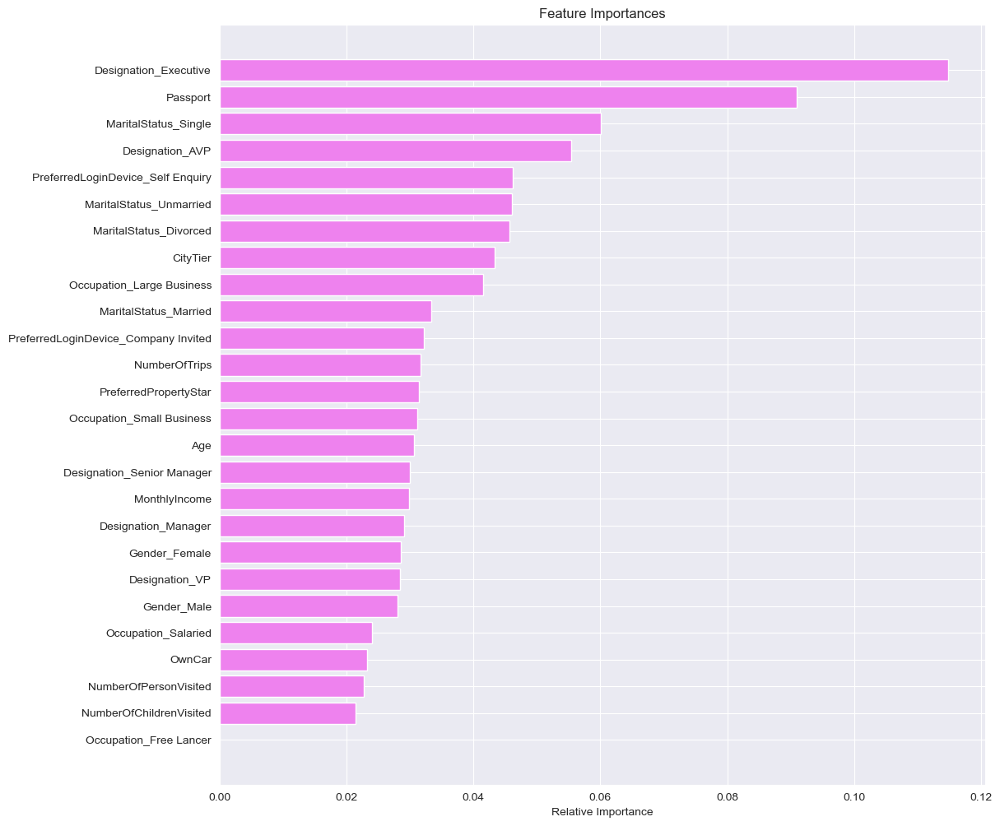

# Model Building Criteria 

The travel company "Visit with us", identified that they want to create a prediction model using previously available data to reduce marketing cost (OPEX - Operating Expenditure).

There are 2 cases where the prediction model can give incorrect predictions:
1. Predicts that a customer **will take** the new plan but when Sales reaches out and pitches they **decline** the offer.
    * False Positive (Type 1 Error)
    * Cost to company - Wastage of operating expenditure in Marketing and Sales.

2. Predicts that a customer **will not take** the new plan. Customer ignored but a highly suitable candidate willing and interested.
    * False Negative (Type 2 Error)
    * Cost to company - Loss of possible customer, Revenue Loss.

Of these 2 cases, the most expensive one is **Case 2** - **False Negative**, as lost business opportunity will hurt the bottomline of any business enterprise.

Therefore, minimizing the **False Negatives** are critical.   
<font color='red'>The metric to be maximized is **Recall**.

---

# Model Building Preparation

**Define functions**
* Metric scores(accuracy, recall and precision)
* Confusion matrix


```python
def metrics_summary(model,flag=True):
    
    a = []  # defining an empty list to store train and test results
    
    # Model Predictions
    pred_train = model.predict(X_train)
    pred_test = model.predict(X_test)
    
    # Accuracy - Train and Test 
    train_accuracy = model.score(X_train, y_train)
    test_accuracy = model.score(X_test, y_test)
    
    # Recall - Train and Test 
    train_recall = metrics.recall_score(y_train, pred_train)
    test_recall = metrics.recall_score(y_test, pred_test)
    
    # Precision - Train and Test 
    train_precision = metrics.precision_score(y_train, pred_train)
    test_precision = metrics.precision_score(y_test, pred_test)
    
    # Appending metrics to list "a"
    a.append(train_accuracy)
    a.append(test_accuracy)
    a.append(train_recall)
    a.append(test_recall)
    a.append(train_precision)
    a.append(test_precision)    
   
    # If the flag is set to True then only the following print statements will be dispayed
    if flag == True:
        print("Accuracy on training set : ", model.score(X_train, y_train))
        print("Accuracy on test set : ", model.score(X_test, y_test))
        print("Recall on training set : ", metrics.recall_score(y_train, pred_train))
        print("Recall on test set : ", metrics.recall_score(y_test, pred_test))
        print("Precision on training set : ", metrics.precision_score(y_train, pred_train))
        print("Precision on test set : ", metrics.precision_score(y_test, pred_test))
    else:
        return a  # returning the list with train and test scores   
```


```python
def make_confusion_matrix(model, y_actual, labels=[1, 0]):
    '''
    model : classifier to predict values of X
    y_actual : ground truth  
    
    '''
    y_predict = model.predict(X_test)
    cm = metrics.confusion_matrix(y_actual, y_predict, labels=[0, 1])
    df_cm = pd.DataFrame(
        cm,
        index=[i for i in ["Actual - No", "Actual - Yes"]],
        columns=[i for i in ['Predicted - No', 'Predicted - Yes']])
    group_counts = ["{0:0.0f}".format(value) for value in cm.flatten()]
    group_percentages = [
        "{0:.2%}".format(value) for value in cm.flatten() / np.sum(cm)
    ]
    labels = [f"{v1}\n{v2}" for v1, v2 in zip(group_counts, group_percentages)]
    labels = np.asarray(labels).reshape(2, 2)
    plt.figure(figsize=(5, 5))
    sns.heatmap(df_cm, annot=labels, fmt='')
    plt.ylabel('True label')
    plt.xlabel('Predicted label')
    plt.show()
```


```python
def confusion_matrix_metrics_summary(model):
    make_confusion_matrix(model,y_test)
    metrics_summary(model) 
```

**Confusion Matrix definition:**

| **Parameter**| **Description** | 
| :-: | :-: |
| **True Positive** | Predict **potential** customer and the customer **purchased** the travel package|
| **False Positive** | Predict **potential** customer and the customer **did not purchase** the travel package|
| **True Negative** | Predict **ineligible** customer and the customer **did not purchase** the travel package|
| **False Negative** | Predict **ineligible** customer and the customer **purchased** the travel package|

---

# Model Building - Bagging

Before model building is started, we must split the dataset into the Independent and Dependent variables.
* Independent variables - predictors
* Dependent variables - response

In this project, the response variable is the `ProdTaken` , and the predictors are all the other variables.

For **Bagging** we shall use the dataframe **data** which has outliers

Model Building - Approach
1. Data preparation - Partition the data into train and test set.
3. Decision Tree Modeling
3. Bagging Ensemble
4. Random Forest Ensemble

---

## Model Building Preparation

**Separating Independent and Dependent variables**


```python
# Separating Independent and Dependent variables

# Independant variables
X = data.drop('ProdTaken', axis=1)
# Dependent variable
y = data['ProdTaken']
```


```python
# Convert categorical variables to dummy variables
# Keep all dummy variables as the Bagging methods use Decision Trees
X = pd.get_dummies(X)
```


```python
# Split into training and test set
X_train, X_test, y_train, y_test = train_test_split(X,
                                                    y,
                                                    test_size=0.30,
                                                    stratify=y,
                                                    random_state=1)
```

**Lets check Dependent variable ratio in split data**


```python
print("Training True Values    : {0} ({1:0.2f}%)".format(
    len(y_train[y_train[:] == 1]),
    (len(y_train[y_train[:] == 1]) / len(y_train)) * 100))
print("Training False Values   : {0} ({1:0.2f}%)".format(
    len(y_train[y_train[:] == 0]),
    (len(y_train[y_train[:] == 0]) / len(y_train)) * 100))

print('--' * 55)

print("Test True Values        : {0} ({1:0.2f}%)".format(
    len(y_test[y_test[:] == 1]),
    (len(y_test[y_test[:] == 1]) / len(y_test)) * 100))
print("Test False Values       : {0} ({1:0.2f}%)".format(
    len(y_test[y_test[:] == 0]),
    (len(y_test[y_test[:] == 0]) / len(y_test)) * 100))
```

    Training True Values    : 644 (18.82%)
    Training False Values   : 2777 (81.18%)
    --------------------------------------------------------------------------------------------------------------
    Test True Values        : 276 (18.81%)
    Test False Values       : 1191 (81.19%)
    

---

## Decision Tree Model


```python
# Make the Decision Tree model
dtree = DecisionTreeClassifier()

# Fit Model to training data.
dtree.fit(X_train, y_train)
```


    DecisionTreeClassifier()


```python
confusion_matrix_metrics_summary(dtree)
```


    

    


    Accuracy on training set :  1.0
    Accuracy on test set :  0.8643490115882754
    Recall on training set :  1.0
    Recall on test set :  0.6594202898550725
    Precision on training set :  1.0
    Precision on test set :  0.6341463414634146
    

* Model overfit on the Training data. Recall on Test data is 0.65

---

**DecisionTreeClassifier function with reverse weighting of each class**

Since dataset is misbalanced, let's reverse the weightingh of the target variable.


```python
# Make the weighted DecisionTree Classifier model
dtree_wt = DecisionTreeClassifier(class_weight={
    0: 0.188,
    1: 0.812
},
                                  random_state=1)

# Fit Model to training data.
dtree_wt.fit(X_train, y_train)
```


    DecisionTreeClassifier(class_weight={0: 0.188, 1: 0.812}, random_state=1)


```python
confusion_matrix_metrics_summary(dtree_wt)
```


    

    


    Accuracy on training set :  1.0
    Accuracy on test set :  0.8609406952965235
    Recall on training set :  1.0
    Recall on test set :  0.5760869565217391
    Precision on training set :  1.0
    Precision on test set :  0.6463414634146342
    

* After reversing class weights, the decision tree is still overfitting on the Training dataset.
* Recall on Test set has decreased from 0.66 to 0.58

---

### Reducing over fitting (Regularization)

**GridSearch**

* Grid search is a tuning technique that attempts to compute the optimum values of hyperparameters. 
* The parameters of the estimator/model used to apply these methods are optimized by cross-validated grid-search over a parameter grid.


```python
# Choose the type of classifier.
estimator = DecisionTreeClassifier()

# Grid of parameters to choose from
parameters = {'max_depth': list(np.arange(2,20)) + [None], 
              'min_samples_leaf': [1, 3, 5, 7, 10],
              'max_leaf_nodes' : [2, 3, 5, 10, 15] + [None],
              'min_impurity_decrease': [0.001, 0.01, 0.1, 0.0]
             }


# Type of scoring used to compare parameter combinations
scorer = metrics.make_scorer(metrics.recall_score)

# Run the grid search
grid_obj = GridSearchCV(estimator, parameters, scoring=scorer, cv=5)
grid_obj = grid_obj.fit(X_train, y_train)

# Set the clf to the best combination of parameters
estimator = grid_obj.best_estimator_

# Fit the best algorithm to the data.
dtree_gridCV = estimator.fit(X_train, y_train)
```


```python
confusion_matrix_metrics_summary(dtree_gridCV)
```


    

    


    Accuracy on training set :  1.0
    Accuracy on test set :  0.8623040218132243
    Recall on training set :  1.0
    Recall on test set :  0.644927536231884
    Precision on training set :  1.0
    Precision on test set :  0.6312056737588653
    

* After using GridSearchCV, there is still overfitting but the Recall on the Test data has decreased from 0.65 (no hypertuning) to 0.64

---


```python
# importance of features in the tree building ( The importance of a feature is computed as the
# (normalized) total reduction of the criterion brought by that feature. It is also known as the Gini importance )

print(pd.DataFrame(dtree_gridCV.feature_importances_, columns=[
      "Imp"], index=X_train.columns).sort_values(by='Imp', ascending=False))
```

                                               Imp
    MonthlyIncome                         0.237084
    Age                                   0.166901
    NumberOfTrips                         0.089520
    Designation_Executive                 0.073366
    Passport                              0.059067
    CityTier                              0.058004
    PreferredPropertyStar                 0.041529
    NumberOfPersonVisited                 0.036289
    NumberOfChildrenVisited               0.029079
    MaritalStatus_Single                  0.023656
    Occupation_Salaried                   0.020345
    Occupation_Large Business             0.019714
    MaritalStatus_Married                 0.015755
    PreferredLoginDevice_Company Invited  0.015433
    Gender_Male                           0.015091
    OwnCar                                0.013347
    Occupation_Small Business             0.013313
    MaritalStatus_Divorced                0.012387
    Designation_Senior Manager            0.012355
    Gender_Female                         0.011186
    PreferredLoginDevice_Self Enquiry     0.010949
    MaritalStatus_Unmarried               0.009218
    Designation_Manager                   0.008571
    Designation_AVP                       0.007843
    Occupation_Free Lancer                0.000000
    Designation_VP                        0.000000
    


```python
feature_names = X_train.columns
importances = dtree_gridCV.feature_importances_
indices = np.argsort(importances)

plt.figure(figsize=(12,12))
plt.title('Feature Importances')
plt.barh(range(len(indices)), importances[indices], color='violet', align='center')
plt.yticks(range(len(indices)), [feature_names[i] for i in indices])
plt.xlabel('Relative Importance')
plt.show()
```


    

    


---

## Bagging Classifier


```python
# Make the Bagging Classifier model
bagging = BaggingClassifier(random_state=1)
# Fit Model to training data.
bagging.fit(X_train,y_train)
```


    BaggingClassifier(random_state=1)


```python
confusion_matrix_metrics_summary(bagging)
```


    

    


    Accuracy on training set :  0.9929845074539608
    Accuracy on test set :  0.9052488070892979
    Recall on training set :  0.9642857142857143
    Recall on test set :  0.5579710144927537
    Precision on training set :  0.9983922829581994
    Precision on test set :  0.9005847953216374
    

* Bagging classifier is giving a better accuracy than decision tree but is performing poorly on the test set in terms of recall.

---

**Bagging Classifier with weighted decision tree**


```python
bagging_wt = BaggingClassifier(base_estimator=DecisionTreeClassifier(
    class_weight={
        0: 0.188,
        1: 0.812
    }, random_state=1),
    random_state=1)
bagging_wt.fit(X_train, y_train)
```


    BaggingClassifier(base_estimator=DecisionTreeClassifier(class_weight={0: 0.188,
                                                                          1: 0.812},
                                                            random_state=1),
                      random_state=1)


```python
confusion_matrix_metrics_summary(bagging_wt)
```


    

    


    Accuracy on training set :  0.9915229465068693
    Accuracy on test set :  0.8841172460804363
    Recall on training set :  0.9565217391304348
    Recall on test set :  0.4528985507246377
    Precision on training set :  0.9983792544570502
    Precision on test set :  0.8680555555555556
    

* Performance has decreased when using inverting the class weights for Bagging.

---

### Hyperparameter Tuning


```python
# Choose the type of classifier.
bagging_tuned = RandomForestClassifier(random_state=1)

# Grid of parameters to choose from
parameters = {
    'max_depth': [4, 6, 8, 10, None],
    'max_features': ['sqrt', 'log2', None],
    'n_estimators': [80, 90, 100, 110, 120]
}

# Type of scoring used to compare parameter combinations
scorer = metrics.make_scorer(metrics.recall_score)

# Run the grid search
grid_obj = GridSearchCV(bagging_tuned, parameters, scoring=scorer, cv=5)
grid_obj = grid_obj.fit(X_train, y_train)

# Set the clf to the best combination of parameters
bagging_tuned = grid_obj.best_estimator_

# Fit the best algorithm to the data.
bagging_tuned.fit(X_train, y_train)
```


    RandomForestClassifier(max_features=None, n_estimators=110, random_state=1)


```python
confusion_matrix_metrics_summary(bagging_tuned)
```


    

    


    Accuracy on training set :  1.0
    Accuracy on test set :  0.9134287661895024
    Recall on training set :  1.0
    Recall on test set :  0.6123188405797102
    Precision on training set :  1.0
    Precision on test set :  0.8941798941798942
    

* Accuracy and Recall has improved after tuning the Bagging Classifier.

---


```python
# importance of features in the tree building
# (The importance of a feature is computed as the
# (normalized) total reduction of the criterion
# brought by that feature. It is also known as the Gini importance )

print(pd.DataFrame(bagging_tuned.feature_importances_, columns=[
      "Imp"], index=X_train.columns).sort_values(by='Imp', ascending=False))
```

                                               Imp
    MonthlyIncome                         0.201928
    Age                                   0.164571
    NumberOfTrips                         0.087109
    Designation_Executive                 0.065098
    Passport                              0.061935
    CityTier                              0.049254
    PreferredPropertyStar                 0.046594
    NumberOfChildrenVisited               0.036144
    NumberOfPersonVisited                 0.033556
    MaritalStatus_Single                  0.027599
    OwnCar                                0.022226
    MaritalStatus_Married                 0.019240
    Occupation_Small Business             0.019075
    MaritalStatus_Unmarried               0.018647
    Occupation_Salaried                   0.018521
    Occupation_Large Business             0.017495
    Gender_Female                         0.017189
    PreferredLoginDevice_Company Invited  0.016925
    MaritalStatus_Divorced                0.016241
    Gender_Male                           0.016222
    PreferredLoginDevice_Self Enquiry     0.016032
    Designation_Senior Manager            0.011688
    Designation_Manager                   0.010318
    Designation_AVP                       0.004072
    Designation_VP                        0.002272
    Occupation_Free Lancer                0.000050
    


```python
feature_names = X_train.columns
importances = bagging_tuned.feature_importances_
indices = np.argsort(importances)

plt.figure(figsize=(12, 12))
plt.title('Feature Importances')
plt.barh(range(len(indices)),
         importances[indices], color='violet', align='center')
plt.yticks(range(len(indices)), [feature_names[i] for i in indices])
plt.xlabel('Relative Importance')
plt.show()
```


    

    


---

## Random Forest Model


```python
rf_estimator = RandomForestClassifier(random_state=1)
rf_estimator.fit(X_train, y_train)
```


    RandomForestClassifier(random_state=1)


```python
confusion_matrix_metrics_summary(rf_estimator)
```


    

    


    Accuracy on training set :  1.0
    Accuracy on test set :  0.8916155419222904
    Recall on training set :  1.0
    Recall on test set :  0.4927536231884058
    Precision on training set :  1.0
    Precision on test set :  0.8774193548387097
    

---


```python
print(pd.DataFrame(rf_estimator.feature_importances_, columns=[
      "Imp"], index=X_train.columns).sort_values(by='Imp', ascending=False))
```

                                               Imp
    MonthlyIncome                         0.167202
    Age                                   0.156763
    NumberOfTrips                         0.089317
    Passport                              0.075652
    PreferredPropertyStar                 0.053453
    CityTier                              0.043669
    NumberOfChildrenVisited               0.043628
    NumberOfPersonVisited                 0.037330
    Designation_Executive                 0.035024
    OwnCar                                0.028770
    MaritalStatus_Single                  0.026230
    Occupation_Small Business             0.024684
    Gender_Female                         0.023150
    Occupation_Salaried                   0.022060
    PreferredLoginDevice_Company Invited  0.021840
    Gender_Male                           0.020525
    MaritalStatus_Married                 0.020509
    PreferredLoginDevice_Self Enquiry     0.019670
    Occupation_Large Business             0.017610
    Designation_Manager                   0.016933
    MaritalStatus_Divorced                0.016286
    MaritalStatus_Unmarried               0.016097
    Designation_Senior Manager            0.012747
    Designation_AVP                       0.006632
    Designation_VP                        0.004111
    Occupation_Free Lancer                0.000107
    

---

### Hyperparameter Tuning


```python
# Choose the type of classifier.
rf_tuned = RandomForestClassifier(random_state=1)

# Grid of parameters to choose from
parameters = {
    'max_depth': [4, 6, 8, 10, None],
    'max_features': ['sqrt', 'log2', None],
    'n_estimators': [80, 90, 100, 110, 120]
}

# Type of scoring used to compare parameter combinations
scorer = metrics.make_scorer(metrics.recall_score)

# Run the grid search
grid_obj = GridSearchCV(rf_tuned, parameters, scoring=scorer, cv=5)
grid_obj = grid_obj.fit(X_train, y_train)

# Set the clf to the best combination of parameters
rf_tuned = grid_obj.best_estimator_

# Fit the best algorithm to the data.
rf_tuned.fit(X_train, y_train)
```


    RandomForestClassifier(max_features=None, n_estimators=110, random_state=1)


```python
confusion_matrix_metrics_summary(rf_tuned)
```


    

    


    Accuracy on training set :  1.0
    Accuracy on test set :  0.9134287661895024
    Recall on training set :  1.0
    Recall on test set :  0.6123188405797102
    Precision on training set :  1.0
    Precision on test set :  0.8941798941798942
    

---


```python
# importance of features in the tree building
# (The importance of a feature is computed as the
# (normalized) total reduction of the criterion
# brought by that feature. It is also known as the Gini importance )

print(pd.DataFrame(rf_tuned.feature_importances_, columns=[
      "Imp"], index=X_train.columns).sort_values(by='Imp', ascending=False))
```

                                               Imp
    MonthlyIncome                         0.201928
    Age                                   0.164571
    NumberOfTrips                         0.087109
    Designation_Executive                 0.065098
    Passport                              0.061935
    CityTier                              0.049254
    PreferredPropertyStar                 0.046594
    NumberOfChildrenVisited               0.036144
    NumberOfPersonVisited                 0.033556
    MaritalStatus_Single                  0.027599
    OwnCar                                0.022226
    MaritalStatus_Married                 0.019240
    Occupation_Small Business             0.019075
    MaritalStatus_Unmarried               0.018647
    Occupation_Salaried                   0.018521
    Occupation_Large Business             0.017495
    Gender_Female                         0.017189
    PreferredLoginDevice_Company Invited  0.016925
    MaritalStatus_Divorced                0.016241
    Gender_Male                           0.016222
    PreferredLoginDevice_Self Enquiry     0.016032
    Designation_Senior Manager            0.011688
    Designation_Manager                   0.010318
    Designation_AVP                       0.004072
    Designation_VP                        0.002272
    Occupation_Free Lancer                0.000050
    


```python
feature_names = X_train.columns
importances = rf_tuned.feature_importances_
indices = np.argsort(importances)

plt.figure(figsize=(12, 12))
plt.title('Feature Importances')
plt.barh(range(len(indices)),
         importances[indices], color='violet', align='center')
plt.yticks(range(len(indices)), [feature_names[i] for i in indices])
plt.xlabel('Relative Importance')
plt.show()
```


    

    


---

# Model Building - Boosting

Before model building is started, we must split the dataset into the Independent and Dependent variables.
* Independent variables - predictors
* Dependent variables - response

In this project, the response variable is the `ProdTaken` , and the predictors are all the other variables.

For **Boosting** we shall model using the data with outliers **data** and data without outliers **data_clean**

---

## Boosting - data with outliers

### Model Building Preparation

**Separating Independent and Dependent variables**


```python
# Separating Independent and Dependent variables

# Independant variables
X = data.drop('ProdTaken', axis=1)
# Dependent variable
y = data['ProdTaken']
```


```python
# Convert categorical variables to dummy variables
# Keep all dummy variables as the Bagging methods use Decision Trees
X = pd.get_dummies(X)
```


```python
# Split into training and test set
X_train, X_test, y_train, y_test = train_test_split(X,
                                                    y,
                                                    test_size=0.30,
                                                    stratify=y,
                                                    random_state=1)
```

**Lets check Dependent variable ratio in split data**


```python
print("Training True Values    : {0} ({1:0.2f}%)".format(
    len(y_train[y_train[:] == 1]),
    (len(y_train[y_train[:] == 1]) / len(y_train)) * 100))
print("Training False Values   : {0} ({1:0.2f}%)".format(
    len(y_train[y_train[:] == 0]),
    (len(y_train[y_train[:] == 0]) / len(y_train)) * 100))

print('--' * 55)

print("Test True Values        : {0} ({1:0.2f}%)".format(
    len(y_test[y_test[:] == 1]),
    (len(y_test[y_test[:] == 1]) / len(y_test)) * 100))
print("Test False Values       : {0} ({1:0.2f}%)".format(
    len(y_test[y_test[:] == 0]),
    (len(y_test[y_test[:] == 0]) / len(y_test)) * 100))
```

    Training True Values    : 644 (18.82%)
    Training False Values   : 2777 (81.18%)
    --------------------------------------------------------------------------------------------------------------
    Test True Values        : 276 (18.81%)
    Test False Values       : 1191 (81.19%)
    

---

### AdaBoost 


```python
ab_classifer=AdaBoostClassifier(random_state=1)
ab_classifer.fit(X_train,y_train)
```


    AdaBoostClassifier(random_state=1)


```python
confusion_matrix_metrics_summary(ab_classifer)
```


    

    


    Accuracy on training set :  0.8439052908506285
    Accuracy on test set :  0.83640081799591
    Recall on training set :  0.281055900621118
    Recall on test set :  0.27898550724637683
    Precision on training set :  0.7182539682539683
    Precision on test set :  0.652542372881356
    

* AdaBoost is not overfitting the data, producing good Accuracy but extremely poor Recall scores.

---

#### Hyperparameter Tuning


```python
# Choose the type of classifier. 
ab_tuned = AdaBoostClassifier(random_state=1)

# Grid of parameters to choose from
parameters = {'n_estimators': np.arange(10,100,10), 
              'learning_rate': [1, 0.1, 0.5, 0.01],
              }

# Type of scoring used to compare parameter combinations
scorer = metrics.make_scorer(metrics.recall_score)

# Run the grid search
grid_obj = GridSearchCV(ab_tuned, parameters, scoring=scorer,cv=5)
grid_obj = grid_obj.fit(X_train, y_train)

# Set the clf to the best combination of parameters
ab_tuned = grid_obj.best_estimator_

# Fit the best algorithm to the data. 
ab_tuned.fit(X_train, y_train)
```


    AdaBoostClassifier(learning_rate=1, n_estimators=90, random_state=1)


```python
confusion_matrix_metrics_summary(ab_tuned)
```


    

    


    Accuracy on training set :  0.8468284127448115
    Accuracy on test set :  0.8384458077709611
    Recall on training set :  0.29347826086956524
    Recall on test set :  0.29347826086956524
    Precision on training set :  0.7325581395348837
    Precision on test set :  0.6585365853658537
    

* There is no significant increase in scores due to Hyperparameter tuning of AdaBoost.

---

### Gradient Boosting 


```python
gb_estimator=GradientBoostingClassifier(random_state=1)
gb_estimator.fit(X_train,y_train)
```


    GradientBoostingClassifier(random_state=1)


```python
confusion_matrix_metrics_summary(gb_estimator)
```


    

    


    Accuracy on training set :  0.881613563285589
    Accuracy on test set :  0.8650306748466258
    Recall on training set :  0.4363354037267081
    Recall on test set :  0.36594202898550726
    Precision on training set :  0.8699690402476781
    Precision on test set :  0.8145161290322581
    

* Gradient Boosting is not overfitting the data, producing good Accuracy but poor Recall scores although better than AdaBoost.

---

#### Hyperparameter Tuning


```python
# Choose the type of classifier. 
gb_tuned = GradientBoostingClassifier(random_state=1)

# Grid of parameters to choose from

parameters = {'n_estimators': np.arange(50,200,25), 
              'subsample':[0.7,0.8,0.9,1],
              'max_features':[0.7,0.8,0.9,1],
              'max_depth':[3,5,7,10]
              }

# Type of scoring used to compare parameter combinations
scorer = metrics.make_scorer(metrics.recall_score)

# Run the grid search
grid_obj = GridSearchCV(gb_tuned, parameters, scoring=scorer,cv=5)
grid_obj = grid_obj.fit(X_train, y_train)

# Set the clf to the best combination of parameters
gb_tuned = grid_obj.best_estimator_

# Fit the best algorithm to the data. 
gb_tuned.fit(X_train, y_train)
```


    GradientBoostingClassifier(max_depth=7, max_features=0.7, n_estimators=175,
                               random_state=1, subsample=1)


```python
confusion_matrix_metrics_summary(gb_tuned)
```


    

    


    Accuracy on training set :  1.0
    Accuracy on test set :  0.9202453987730062
    Recall on training set :  1.0
    Recall on test set :  0.644927536231884
    Precision on training set :  1.0
    Precision on test set :  0.9035532994923858
    

---

### XGBoost


```python
xgb_estimator=XGBClassifier(random_state=1, eval_metric = 'logloss')
xgb_estimator.fit(X_train,y_train)
```


    XGBClassifier(base_score=0.5, booster='gbtree', colsample_bylevel=1,
                  colsample_bynode=1, colsample_bytree=1, eval_metric='logloss',
                  gamma=0, gpu_id=-1, importance_type='gain',
                  interaction_constraints='', learning_rate=0.300000012,
                  max_delta_step=0, max_depth=6, min_child_weight=1, missing=nan,
                  monotone_constraints='()', n_estimators=100, n_jobs=12,
                  num_parallel_tree=1, random_state=1, reg_alpha=0, reg_lambda=1,
                  scale_pos_weight=1, subsample=1, tree_method='exact',
                  validate_parameters=1, verbosity=None)


```python
confusion_matrix_metrics_summary(xgb_estimator)
```


    

    


    Accuracy on training set :  0.9959076293481438
    Accuracy on test set :  0.8916155419222904
    Recall on training set :  0.9782608695652174
    Recall on test set :  0.5579710144927537
    Precision on training set :  1.0
    Precision on test set :  0.806282722513089
    

---

#### Hyperparameter Tuning


```python
# Choose the type of classifier. 
xgb_tuned = XGBClassifier(random_state=1,eval_metric = 'logloss')

# Grid of parameters to choose from
parameters = {'n_estimators': [75,100,125,150], 
              'subsample':[0.7, 0.8, 0.9, 1],
              'gamma':[0, 1, 3, 5],
              'colsample_bytree':[0.7, 0.8, 0.9, 1],
              'colsample_bylevel':[0.7, 0.8, 0.9, 1]
              }

# Type of scoring used to compare parameter combinations
scorer = metrics.make_scorer(metrics.recall_score)

# Run the grid search
grid_obj = GridSearchCV(xgb_tuned, parameters, scoring=scorer,cv=5)
grid_obj = grid_obj.fit(X_train, y_train)

# Set the clf to the best combination of parameters
xgb_tuned = grid_obj.best_estimator_

# Fit the best algorithm to the data. 
xgb_tuned.fit(X_train, y_train)
```


    XGBClassifier(base_score=0.5, booster='gbtree', colsample_bylevel=0.8,
                  colsample_bynode=1, colsample_bytree=0.9, eval_metric='logloss',
                  gamma=0, gpu_id=-1, importance_type='gain',
                  interaction_constraints='', learning_rate=0.300000012,
                  max_delta_step=0, max_depth=6, min_child_weight=1, missing=nan,
                  monotone_constraints='()', n_estimators=150, n_jobs=12,
                  num_parallel_tree=1, random_state=1, reg_alpha=0, reg_lambda=1,
                  scale_pos_weight=1, subsample=1, tree_method='exact',
                  validate_parameters=1, verbosity=None)


```python
confusion_matrix_metrics_summary(xgb_tuned)
```


    

    


    Accuracy on training set :  0.9988307512423268
    Accuracy on test set :  0.9004771642808452
    Recall on training set :  0.9937888198757764
    Recall on test set :  0.5978260869565217
    Precision on training set :  1.0
    Precision on test set :  0.825
    

* Tuned XGBoost has produced a high test set Accuracy and Recall. There has been a 4% increase in Recall score.

---


```python
# importance of features in the tree building ( The importance of a feature is computed as the
# (normalized) total reduction of the criterion brought by that feature. It is also known as the Gini importance )

print(pd.DataFrame(xgb_tuned.feature_importances_, columns=[
      "Imp"], index=X_train.columns).sort_values(by='Imp', ascending=False))
```

                                               Imp
    Designation_Executive                 0.114874
    Passport                              0.090946
    MaritalStatus_Single                  0.060041
    Designation_AVP                       0.055378
    PreferredLoginDevice_Self Enquiry     0.046155
    MaritalStatus_Unmarried               0.046079
    MaritalStatus_Divorced                0.045678
    CityTier                              0.043386
    Occupation_Large Business             0.041551
    MaritalStatus_Married                 0.033344
    PreferredLoginDevice_Company Invited  0.032203
    NumberOfTrips                         0.031700
    PreferredPropertyStar                 0.031455
    Occupation_Small Business             0.031141
    Age                                   0.030704
    Designation_Senior Manager            0.030014
    MonthlyIncome                         0.029826
    Designation_Manager                   0.029041
    Gender_Female                         0.028583
    Designation_VP                        0.028494
    Gender_Male                           0.028074
    Occupation_Salaried                   0.023983
    OwnCar                                0.023254
    NumberOfPersonVisited                 0.022684
    NumberOfChildrenVisited               0.021413
    Occupation_Free Lancer                0.000000
    


```python
feature_names = X_train.columns
importances = xgb_tuned.feature_importances_
indices = np.argsort(importances)

plt.figure(figsize=(12,12))
plt.title('Feature Importances')
plt.barh(range(len(indices)), importances[indices], color='violet', align='center')
plt.yticks(range(len(indices)), [feature_names[i] for i in indices])
plt.xlabel('Relative Importance')
plt.show()
```


    

    


---

## Boosting - data WITHOUT Outliers

Since Boosting is affected by outliers, we have cloned and cleaned the data. The dataframe **data_clean** will be used in the following analysis.

### Model Building Preparation

**Separating Independent and Dependent variables**


```python
# Separating Independent and Dependent variables (data_clean)

# Independant variables
X = data_clean.drop('ProdTaken', axis=1)
# Dependent variable
y = data_clean['ProdTaken']
```


```python
# Convert categorical variables to dummy variables
# Keep all dummy variables as the Bagging methods use Decision Trees
X = pd.get_dummies(X)
```


```python
# Split into training and test set
X_train, X_test, y_train, y_test = train_test_split(X,
                                                    y,
                                                    test_size=0.30,
                                                    stratify=y,
                                                    random_state=1)
```

**Lets check Dependent variable ratio in split data**


```python
print("Training True Values    : {0} ({1:0.2f}%)".format(
    len(y_train[y_train[:] == 1]),
    (len(y_train[y_train[:] == 1]) / len(y_train)) * 100))
print("Training False Values   : {0} ({1:0.2f}%)".format(
    len(y_train[y_train[:] == 0]),
    (len(y_train[y_train[:] == 0]) / len(y_train)) * 100))

print('--' * 55)

print("Test True Values        : {0} ({1:0.2f}%)".format(
    len(y_test[y_test[:] == 1]),
    (len(y_test[y_test[:] == 1]) / len(y_test)) * 100))
print("Test False Values       : {0} ({1:0.2f}%)".format(
    len(y_test[y_test[:] == 0]),
    (len(y_test[y_test[:] == 0]) / len(y_test)) * 100))
```

    Training True Values    : 644 (18.82%)
    Training False Values   : 2777 (81.18%)
    --------------------------------------------------------------------------------------------------------------
    Test True Values        : 276 (18.81%)
    Test False Values       : 1191 (81.19%)
    

---

### AdaBoost 


```python
ab_classifer=AdaBoostClassifier(random_state=1)
ab_classifer.fit(X_train,y_train)
```


    AdaBoostClassifier(random_state=1)


```python
confusion_matrix_metrics_summary(ab_classifer)
```


    

    


    Accuracy on training set :  0.8439052908506285
    Accuracy on test set :  0.8384458077709611
    Recall on training set :  0.281055900621118
    Recall on test set :  0.286231884057971
    Precision on training set :  0.7182539682539683
    Precision on test set :  0.6638655462184874
    

* AdaBoost is not overfitting the data, producing good Accuracy but extremely poor Recall scores.

---

#### Hyperparameter Tuning


```python
# Choose the type of classifier. 
ab_tuned = AdaBoostClassifier(random_state=1)

# Grid of parameters to choose from
parameters = {'n_estimators': np.arange(10,100,10), 
              'learning_rate': [1, 0.1, 0.5, 0.01],
              }

# Type of scoring used to compare parameter combinations
scorer = metrics.make_scorer(metrics.recall_score)

# Run the grid search
grid_obj = GridSearchCV(ab_tuned, parameters, scoring=scorer,cv=5)
grid_obj = grid_obj.fit(X_train, y_train)

# Set the clf to the best combination of parameters
ab_tuned = grid_obj.best_estimator_

# Fit the best algorithm to the data. 
ab_tuned.fit(X_train, y_train)
```


    AdaBoostClassifier(learning_rate=1, n_estimators=70, random_state=1)


```python
confusion_matrix_metrics_summary(ab_tuned)
```


    

    


    Accuracy on training set :  0.8456591639871383
    Accuracy on test set :  0.8384458077709611
    Recall on training set :  0.2826086956521739
    Recall on test set :  0.27898550724637683
    Precision on training set :  0.7338709677419355
    Precision on test set :  0.6695652173913044
    

* There is no significant increase in scores due to Hyperparameter tuning of AdaBoost.

---


```python
# importance of features in the tree building ( The importance of a feature is computed as the
# (normalized) total reduction of the criterion brought by that feature. It is also known as the Gini importance )

print(pd.DataFrame(ab_tuned.feature_importances_, columns=[
      "Imp"], index=X_train.columns).sort_values(by='Imp', ascending=False))
```

                                               Imp
    MonthlyIncome                         0.557143
    Age                                   0.185714
    NumberOfTrips                         0.042857
    PreferredPropertyStar                 0.028571
    Passport                              0.028571
    Designation_Executive                 0.028571
    NumberOfPersonVisited                 0.014286
    Designation_Senior Manager            0.014286
    PreferredLoginDevice_Self Enquiry     0.014286
    Designation_AVP                       0.014286
    Occupation_Large Business             0.014286
    CityTier                              0.014286
    MaritalStatus_Unmarried               0.014286
    MaritalStatus_Single                  0.014286
    Gender_Male                           0.014286
    Designation_Manager                   0.000000
    MaritalStatus_Married                 0.000000
    Occupation_Salaried                   0.000000
    MaritalStatus_Divorced                0.000000
    Gender_Female                         0.000000
    Occupation_Small Business             0.000000
    Occupation_Free Lancer                0.000000
    PreferredLoginDevice_Company Invited  0.000000
    NumberOfChildrenVisited               0.000000
    OwnCar                                0.000000
    Designation_VP                        0.000000
    


```python
feature_names = X_train.columns
importances = ab_tuned.feature_importances_
indices = np.argsort(importances)

plt.figure(figsize=(12,12))
plt.title('Feature Importances')
plt.barh(range(len(indices)), importances[indices], color='violet', align='center')
plt.yticks(range(len(indices)), [feature_names[i] for i in indices])
plt.xlabel('Relative Importance')
plt.show()
```


    

    


---

### Gradient Boosting 


```python
gb_estimator=GradientBoostingClassifier(random_state=1)
gb_estimator.fit(X_train,y_train)
```


    GradientBoostingClassifier(random_state=1)


```python
confusion_matrix_metrics_summary(gb_estimator)
```


    

    


    Accuracy on training set :  0.8786904413914061
    Accuracy on test set :  0.8629856850715747
    Recall on training set :  0.42857142857142855
    Recall on test set :  0.36231884057971014
    Precision on training set :  0.8544891640866873
    Precision on test set :  0.8
    

* Gradient Boosting is not overfitting the data, producing good Accuracy but poor Recall scores although better than AdaBoost.

---

#### Hyperparameter Tuning


```python
# Choose the type of classifier. 
gb_tuned = GradientBoostingClassifier(random_state=1)

# Grid of parameters to choose from

# parameters = {'n_estimators': np.arange(10,100,10), 
#               'learning_rate': [1, 0.1, 0.5, 0.01],
#               }

parameters = {'n_estimators': np.arange(50,200,25), 
              'subsample':[0.7,0.8,0.9,1],
              'max_features':[0.7,0.8,0.9,1],
              'max_depth':[3,5,7,10]
              }

# Type of scoring used to compare parameter combinations
scorer = metrics.make_scorer(metrics.recall_score)

# Run the grid search
grid_obj = GridSearchCV(gb_tuned, parameters, scoring=scorer,cv=5)
grid_obj = grid_obj.fit(X_train, y_train)

# Set the clf to the best combination of parameters
gb_tuned = grid_obj.best_estimator_

# Fit the best algorithm to the data. 
gb_tuned.fit(X_train, y_train)
```


    GradientBoostingClassifier(max_depth=10, max_features=0.9, n_estimators=175,
                               random_state=1, subsample=1)


```python
confusion_matrix_metrics_summary(gb_tuned)
```


    

    


    Accuracy on training set :  1.0
    Accuracy on test set :  0.9216087252897068
    Recall on training set :  1.0
    Recall on test set :  0.6557971014492754
    Precision on training set :  1.0
    Precision on test set :  0.900497512437811
    

---


```python
# importance of features in the tree building ( The importance of a feature is computed as the
# (normalized) total reduction of the criterion brought by that feature. It is also known as the Gini importance )

print(pd.DataFrame(gb_tuned.feature_importances_, columns=[
      "Imp"], index=X_train.columns).sort_values(by='Imp', ascending=False))
```

                                               Imp
    MonthlyIncome                         0.210277
    Age                                   0.169899
    NumberOfTrips                         0.082495
    Designation_Executive                 0.070976
    Passport                              0.061418
    CityTier                              0.050636
    PreferredPropertyStar                 0.047984
    NumberOfChildrenVisited               0.032846
    NumberOfPersonVisited                 0.028376
    MaritalStatus_Single                  0.023166
    OwnCar                                0.021374
    MaritalStatus_Married                 0.019909
    Gender_Male                           0.019149
    MaritalStatus_Divorced                0.017307
    Gender_Female                         0.017155
    Occupation_Small Business             0.016367
    PreferredLoginDevice_Company Invited  0.016272
    Occupation_Large Business             0.015708
    Occupation_Salaried                   0.015252
    PreferredLoginDevice_Self Enquiry     0.015241
    MaritalStatus_Unmarried               0.014110
    Designation_Manager                   0.012024
    Designation_Senior Manager            0.011624
    Designation_AVP                       0.005994
    Designation_VP                        0.004440
    Occupation_Free Lancer                0.000001
    


```python
feature_names = X_train.columns
importances = gb_tuned.feature_importances_
indices = np.argsort(importances)

plt.figure(figsize=(12,12))
plt.title('Feature Importances')
plt.barh(range(len(indices)), importances[indices], color='violet', align='center')
plt.yticks(range(len(indices)), [feature_names[i] for i in indices])
plt.xlabel('Relative Importance')
plt.show()
```


    

    


---

### XGBoost


```python
xgb_estimator=XGBClassifier(random_state=1, eval_metric = 'logloss')
xgb_estimator.fit(X_train,y_train)
```


    XGBClassifier(base_score=0.5, booster='gbtree', colsample_bylevel=1,
                  colsample_bynode=1, colsample_bytree=1, eval_metric='logloss',
                  gamma=0, gpu_id=-1, importance_type='gain',
                  interaction_constraints='', learning_rate=0.300000012,
                  max_delta_step=0, max_depth=6, min_child_weight=1, missing=nan,
                  monotone_constraints='()', n_estimators=100, n_jobs=12,
                  num_parallel_tree=1, random_state=1, reg_alpha=0, reg_lambda=1,
                  scale_pos_weight=1, subsample=1, tree_method='exact',
                  validate_parameters=1, verbosity=None)


```python
confusion_matrix_metrics_summary(xgb_estimator)
```


    

    


    Accuracy on training set :  0.9973691902952353
    Accuracy on test set :  0.9045671438309475
    Recall on training set :  0.9860248447204969
    Recall on test set :  0.5942028985507246
    Precision on training set :  1.0
    Precision on test set :  0.8541666666666666
    

---

#### Hyperparameter Tuning


```python
# Choose the type of classifier. 
xgb_tuned = XGBClassifier(random_state=1,eval_metric = 'logloss')

# Grid of parameters to choose from
parameters = {'n_estimators': [75,100,125,150], 
              'subsample':[0.7, 0.8, 0.9, 1],
              'gamma':[0, 1, 3, 5],
              'colsample_bytree':[0.7, 0.8, 0.9, 1],
              'colsample_bylevel':[0.7, 0.8, 0.9, 1]
              }

# Type of scoring used to compare parameter combinations
scorer = metrics.make_scorer(metrics.recall_score)

# Run the grid search
grid_obj = GridSearchCV(xgb_tuned, parameters, scoring=scorer,cv=5)
grid_obj = grid_obj.fit(X_train, y_train)

# Set the clf to the best combination of parameters
xgb_tuned = grid_obj.best_estimator_

# Fit the best algorithm to the data. 
xgb_tuned.fit(X_train, y_train)
```


    XGBClassifier(base_score=0.5, booster='gbtree', colsample_bylevel=0.9,
                  colsample_bynode=1, colsample_bytree=0.7, eval_metric='logloss',
                  gamma=0, gpu_id=-1, importance_type='gain',
                  interaction_constraints='', learning_rate=0.300000012,
                  max_delta_step=0, max_depth=6, min_child_weight=1, missing=nan,
                  monotone_constraints='()', n_estimators=150, n_jobs=12,
                  num_parallel_tree=1, random_state=1, reg_alpha=0, reg_lambda=1,
                  scale_pos_weight=1, subsample=1, tree_method='exact',
                  validate_parameters=1, verbosity=None)


```python
confusion_matrix_metrics_summary(xgb_tuned)
```


    

    


    Accuracy on training set :  0.9994153756211634
    Accuracy on test set :  0.9059304703476483
    Recall on training set :  0.9968944099378882
    Recall on test set :  0.6086956521739131
    Precision on training set :  1.0
    Precision on test set :  0.8484848484848485
    

* Tuned XGBoost has produced a high test set Accuracy and Recall. There has been a 4% increase in Recall score.

---


```python
# importance of features in the tree building ( The importance of a feature is computed as the
# (normalized) total reduction of the criterion brought by that feature. It is also known as the Gini importance )

print(pd.DataFrame(xgb_tuned.feature_importances_, columns=[
      "Imp"], index=X_train.columns).sort_values(by='Imp', ascending=False))
```

                                               Imp
    Passport                              0.100653
    Designation_Executive                 0.099793
    MaritalStatus_Single                  0.059437
    MaritalStatus_Divorced                0.057028
    PreferredLoginDevice_Self Enquiry     0.048990
    MaritalStatus_Unmarried               0.045857
    Occupation_Large Business             0.041695
    CityTier                              0.040531
    MaritalStatus_Married                 0.038803
    PreferredPropertyStar                 0.032825
    PreferredLoginDevice_Company Invited  0.032582
    MonthlyIncome                         0.031861
    Designation_Senior Manager            0.031834
    Gender_Male                           0.031805
    Age                                   0.031471
    Gender_Female                         0.031165
    Occupation_Small Business             0.030948
    Designation_AVP                       0.030214
    NumberOfTrips                         0.029756
    Occupation_Salaried                   0.029378
    Designation_Manager                   0.027793
    NumberOfPersonVisited                 0.026324
    NumberOfChildrenVisited               0.024950
    Designation_VP                        0.023754
    OwnCar                                0.020555
    Occupation_Free Lancer                0.000000
    


```python
feature_names = X_train.columns
importances = xgb_tuned.feature_importances_
indices = np.argsort(importances)

plt.figure(figsize=(12,12))
plt.title('Feature Importances')
plt.barh(range(len(indices)), importances[indices], color='violet', align='center')
plt.yticks(range(len(indices)), [feature_names[i] for i in indices])
plt.xlabel('Relative Importance')
plt.show()
```


    

    


---

# Stacking Model

**Now, let's build a stacking model with the tuned models - Decision tree, Random forest, AdaBoosting and gradient boosting, then use XGBoost to get the final prediction.**


```python
estimators = [('Decision Tree', dtree_gridCV),
              ('Random Forest', rf_tuned),
#               ('AdaBoost', ab_tuned),
              ('Gradient Boosting', gb_tuned)]
final_estimator = XGBClassifier(random_state=1,eval_metric = 'logloss')
```


```python
stacking_estimator = StackingClassifier(
    estimators=estimators, final_estimator=final_estimator, cv=5)
stacking_estimator.fit(X_train, y_train)
```


    StackingClassifier(cv=5,
                       estimators=[('Decision Tree', DecisionTreeClassifier()),
                                   ('Random Forest',
                                    RandomForestClassifier(max_features=None,
                                                           n_estimators=110,
                                                           random_state=1)),
                                   ('Gradient Boosting',
                                    GradientBoostingClassifier(max_depth=10,
                                                               max_features=0.9,
                                                               n_estimators=175,
                                                               random_state=1,
                                                               subsample=1))],
                       final_estimator=XGBClassifier(base_score=None, booster=Non...
                                                     importance_type='gain',
                                                     interaction_constraints=None,
                                                     learning_rate=None,
                                                     max_delta_step=None,
                                                     max_depth=None,
                                                     min_child_weight=None,
                                                     missing=nan,
                                                     monotone_constraints=None,
                                                     n_estimators=100, n_jobs=None,
                                                     num_parallel_tree=None,
                                                     random_state=1, reg_alpha=None,
                                                     reg_lambda=None,
                                                     scale_pos_weight=None,
                                                     subsample=None,
                                                     tree_method=None,
                                                     validate_parameters=None,
                                                     verbosity=None))


```python
confusion_matrix_metrics_summary(stacking_estimator)
```


    

    


    Accuracy on training set :  0.997953814674072
    Accuracy on test set :  0.9120654396728016
    Recall on training set :  0.9906832298136646
    Recall on test set :  0.6739130434782609
    Precision on training set :  0.9984350547730829
    Precision on test set :  0.8266666666666667
    

---

---
